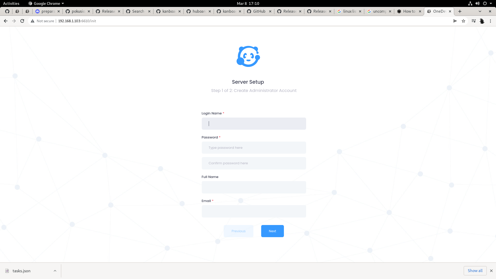
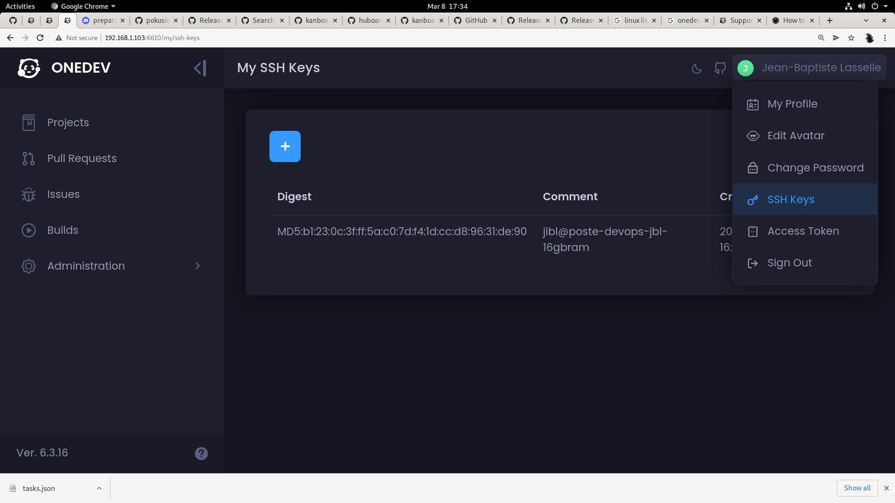
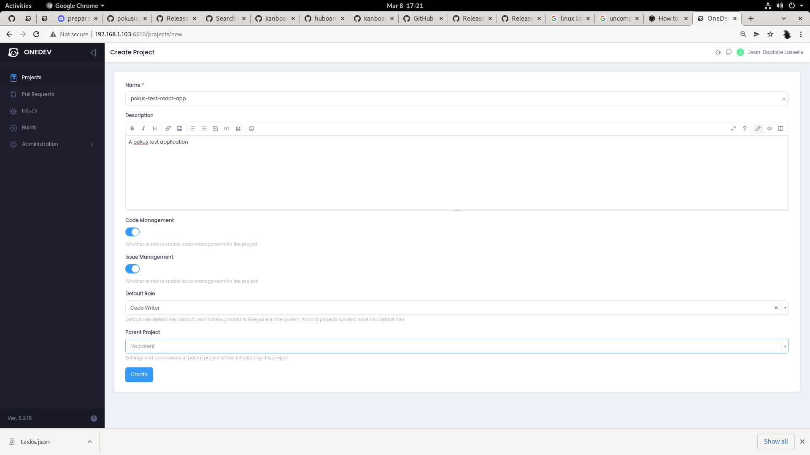
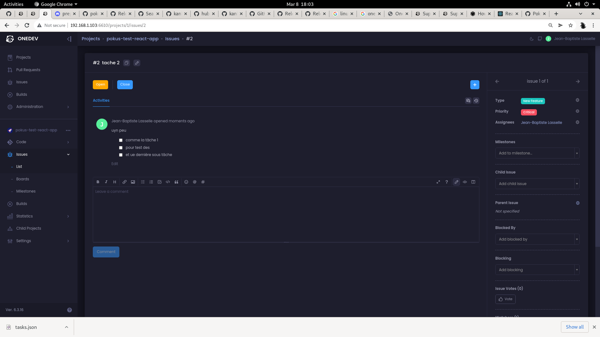
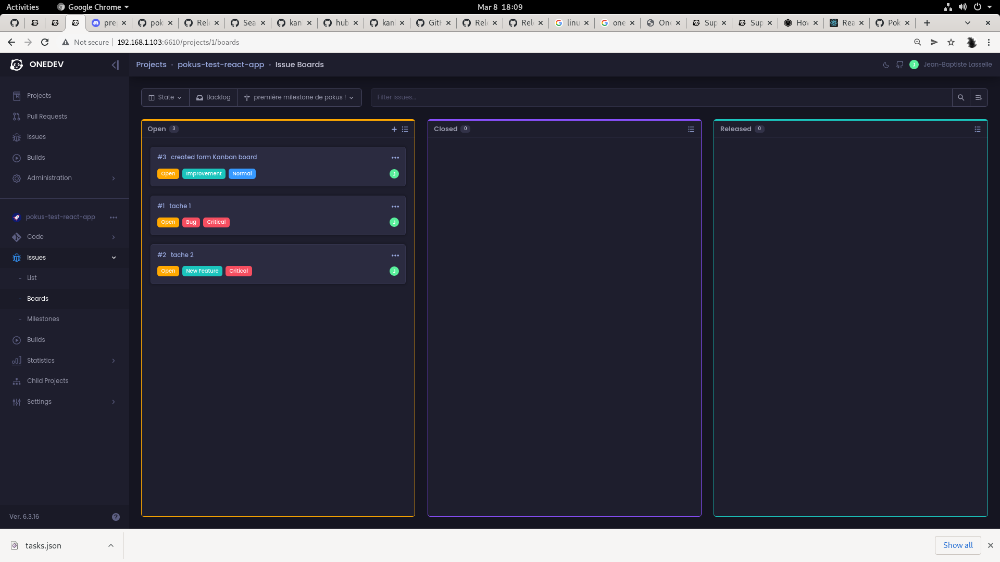

# Kanban and onedev


## running as quickly as possible

> Following instructions at https://code.onedev.io/projects/162/blob/main/pages/quickstart.md

* First launch onedev in one docker container :

```bash
mkdir onedevtry/
cd onedevtry/

docker run --tty --rm -v /var/run/docker.sock:/var/run/docker.sock -v $(pwd)/onedev:/opt/onedev -p 6610:6610 -p 6611:6611 1dev/server

```

* Now you have access to :



* And you go through first setup steps :


* Add your SSH Key to your your OneDev User :




* test your SSH Key :


```bash
export ONEDEV_SSH_PORT="6611"
export ONEDEV_IP_ADDR="192.168.1.103"
export MY_SSH_KEY_PATH='~/.ssh.perso.backed/id_rsa'
ssh -Tvai ${MY_SSH_KEY_PATH} git@${ONEDEV_IP_ADDR} -p ${ONEDEV_SSH_PORT}

```

* create a new onedev "project" named `pokus-test-react-app` : it will create a new git repository i guess



* then pokus-test-react-app


```bash
export ONEDEV_PRJ_NAME="pokus-test-react-app"
export ONEDEV_IP_ADDR="192.168.1.103"
export ONEDEV_HTTP_PORT="6610"
export ONEDEV_SSH_PORT="6611"
export GIT_SSH_COMMAND='ssh -i ~/.ssh.perso.backed/id_rsa -p 6611'

npm i -g create-react-app
npx create-react-app "${ONEDEV_PRJ_NAME}"
cd ${ONEDEV_PRJ_NAME}/
git init
git remote remove onedev
git remote remove onedev_http

git remote add onedev_http http://${ONEDEV_IP_ADDR}:${ONEDEV_HTTP_PORT}/${ONEDEV_PRJ_NAME}
# one dev is a bit different than github/gitlab, its ssh://... instead of git@...
git remote add onedev ssh://${ONEDEV_IP_ADDR}:${ONEDEV_SSH_PORT}/${ONEDEV_PRJ_NAME}

git add -A && git commit -m "init src code"

git push -u onedev master:master

```

## What I would dream of in one development

* there is no concept of labels only of type and priorty on issues, i would want labelling feature :



* I want to be able to customize KAnban dashboard, I am not happy with the column number and columns names :




## Further Assessment

What will be very important in assessing OneDev : How open is it to the world, or how far does it go into integration with other openb source projects ? IS is goin g to be another gitlab big boat that wants to be your whole world ?


## Kubernetes setup

### `k3d`

> https://medium.com/nerd-for-tech/onedev-with-kubernetes-and-letsencrypt-c63d16a3a31
